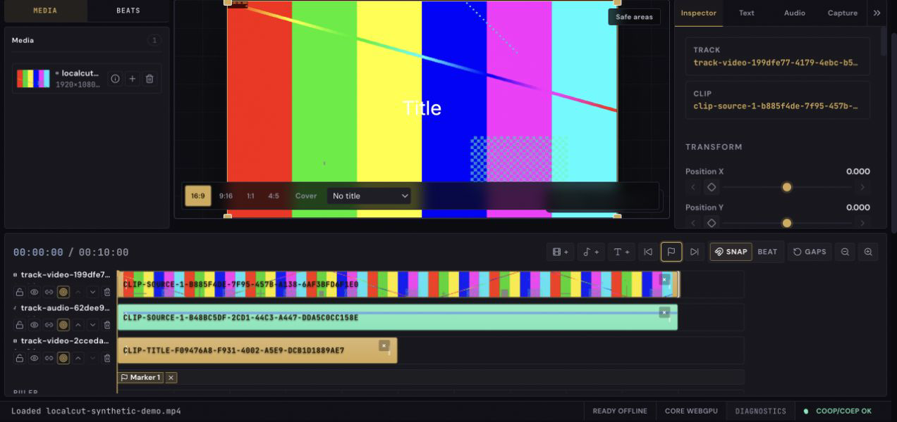
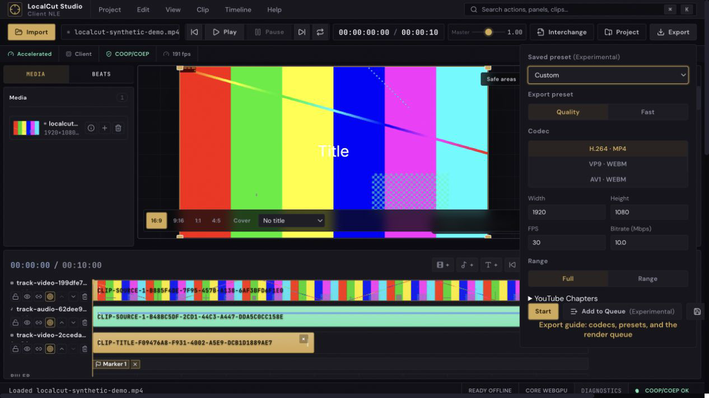

# LocalCut Studio

LocalCut Studio is a browser-native non-linear video editor. Local media stays in the browser for editing, analysis, preview, and export: LocalCut has no application media-upload backend. Its full-performance path combines WebCodecs, WebGPU, workers, `SharedArrayBuffer`, and Mediabunny, while explicit capability tiers keep reduced or unavailable workflows honest.

[Open the current LocalCut deployment](https://localcut.shenghaoc.workers.dev/) or [run it locally](#local-development). The deployment serves the static app with the COOP/COEP headers required by the accelerated clock.

## Screenshots





Screenshots use synthetic test media and contain no uploaded or private user content.

## What LocalCut can do

### Editing

- Import common video, audio, still-image, subtitle, and plain Lottie JSON media that the browser can decode.
- Build multi-track timelines with linked audio/video, track controls, snapping, markers, and undo/redo.
- Trim, split, move, ripple, roll, slip, slide, insert, overwrite, lift, and extract clips.
- Add titles, captions, transitions, transforms, keyframes, and clip effects.

### Preview and finishing

- Preview and composite through WebGPU when supported, with worker-owned reduced rendering paths on less capable browsers.
- Apply colour controls, LUTs, scopes, transforms, layered compositing, and audio mixing.
- Import, edit, style, burn in, and export SRT/VTT captions.
- Use capability-gated recording, replay, live-scene, and on-device analysis tools where their required browser APIs are available.

### Export and interchange

- Export with live capability probing: H.264/MP4 and VP9/WebM when supported, plus AV1/WebM on the core WebGPU tier.
- Export full timelines or marked ranges and save caption sidecars.
- Package and relink local projects; export timelines as OpenTimelineIO or cuts-only CMX3600 EDL.
- Re-container or transcode whole files with the standalone media converter.

### Local-first workflows

- Keep project state and working caches in browser-managed IndexedDB and OPFS storage.
- Install an offline-capable PWA shell; optional model-backed tools become offline-capable only after an explicit first download.
- Work without accounts, cloud project storage, or server-side media rendering.

## Engineering highlights

- Sustained decode, analysis, GPU, encode, mux, and pixel work runs in workers so the main thread remains responsive.
- Accelerated frame paths preserve GPU ownership and deterministic `VideoFrame.close()` cleanup instead of hiding CPU readbacks.
- Mediabunny provides lazy local-media access and browser-native demux/mux integration.
- Runtime probes select real execution paths instead of assuming that every Chromium installation has the same codecs or GPU support.
- COOP/COEP isolation enables the high-frequency `SharedArrayBuffer` playback clock while the shell remains usable when isolation is unavailable.
- Verification spans Node unit tests, real-Chromium Browser Mode tests, Playwright flows, build gates, and manual media/GPU checks.

## Capability tiers and browser support

LocalCut is desktop-first. Codec export support is probed independently within each tier.

| Tier                   | Typical requirements                                                                                | Expected experience                                                                                   |
| ---------------------- | --------------------------------------------------------------------------------------------------- | ----------------------------------------------------------------------------------------------------- |
| `core-webgpu`          | WebGPU, usable WebCodecs decode, `OffscreenCanvas`, `SharedArrayBuffer`, and cross-origin isolation | Full accelerated editor path, including GPU effects and the broadest export options                   |
| `compatibility-webgpu` | A usable worker WebGPU path plus video decode and `OffscreenCanvas`                                 | GPU-backed compatibility rendering with clearly disclosed effect or export constraints                |
| `limited-webcodecs`    | Usable WebCodecs decode and worker-owned Canvas2D                                                   | Preview and compatible export without GPU effects; reduced workflows are labelled                     |
| `shell-only`           | Required media APIs are missing                                                                     | The app shell and documentation load, while unsupported preview and export actions remain unavailable |

The capability indicator in the app is authoritative for the current browser and machine. Modern Chromium desktop provides the intended experience; other browsers may enter a reduced tier or lack a usable editing backend.

## Privacy and client-compute architecture

```text
Cloudflare
  └── serves static application assets and security headers

Browser
  ├── imports local media
  ├── runs preview, effects, and analysis
  ├── stores local project state
  └── performs export

No LocalCut application server
  ├── receives uploaded source media
  ├── renders projects
  ├── stores user accounts
  └── stores cloud projects
```

Normal import, editing, and export do not upload source media to a LocalCut backend, and the app does not include application telemetry. Network access still occurs for ordinary hosting requests, explicitly requested runtime/model downloads, and Chrome-managed language-model downloads. WHIP publishing sends media to the endpoint the user configures, with any bearer token stored locally.

## Support boundary

### Supported

The stable v1 loop covers local media import, multi-track editing, browser-capability-probed preview and direct export, core titles/captions/transitions/effects, local project persistence and packaging, OTIO and cuts-only EDL interchange, and whole-file media conversion. Exact codec availability depends on the browser probe.

### Experimental or capability-dependent

- Recording, replay buffer, Program Mode, and WHIP publishing depend on specific capture, encode, isolation, and endpoint capabilities.
- Render Queue and saved export presets are labelled Experimental.
- Auto Captions, Audio Cleanup, and Portrait Matte require explicit model loading and compatible hardware/runtime support. Smart Reframe has a model-free saliency path plus an optional face-detection model.
- Browser built-in Language Tools are a hidden progressive enhancement; WebNN is runtime groundwork rather than a promise that a shipped model uses it.
- Frame interpolation is not wired into the supported export workflow and remains hidden.

### Not bundled or unsupported

Landmark-driven beauty processing has a real gated ORT/WebGPU engine, but LocalCut does not bundle a license-verified detector/landmark model pair. The shipped manifest is intentionally a rejected template, so beauty processing is not part of the supported out-of-the-box feature set.

LocalCut also does not provide accounts, cloud project sync, collaboration, mobile-optimized editing, server rendering, DRM workflows, direct RTMP output, or professional interchange beyond the documented formats. AAF and FCPXML require an external `otioconvert` workflow; MP4 chapter embedding is not supported.

See [the detailed release and support boundary](docs/RELEASE.md) for the maintained classification.

## Local development

Prerequisites are a recent Node.js installation, pnpm/Vite+, and a modern desktop browser.

```bash
git clone https://github.com/shenghaoc/localcut.git
cd localcut
vp install
vp dev
```

Open [http://localhost:5173](http://localhost:5173). Development and production must preserve COOP/COEP headers for the accelerated `SharedArrayBuffer` clock; check the in-app capability indicator rather than assuming the full tier is active.

## Testing and quality gates

The current baseline contains 2,504 passing Node tests across 225 files. Browser Mode runs 54 tests across 14 files: 49 pass and 5 capability-specific cases skip on the verified machine.

```bash
vp test run          # Node Vitest unit tests
vp run test:browser  # Vitest Browser Mode in real Chromium
vp run test:e2e      # Playwright flows; WHIP coverage requires MediaMTX
vp run check         # Format, lint, typecheck, Node tests, and production build
```

Browser Mode and Playwright E2E are separate from `vp run check`. The WHIP E2E flow requires the documented MediaMTX service; see the [media-fixture guide](docs/MEDIA_FIXTURES.md) and [deployment-verification guide](docs/VERIFY_DEPLOYMENT.md) for manual checks.

## Deployment

`vp build` creates the static PWA in `dist/`. Wrangler deploys those assets through the `localcut` Cloudflare Worker, whose configuration preserves SPA fallback and cross-origin-isolation headers.

```bash
vp run deploy
```

## Repository documentation and contributing

- [AGENTS.md](AGENTS.md) routes contributors and coding agents to repository rules and verification commands.
- [`.kiro/steering/`](.kiro/steering/) contains current product, architecture, security, accessibility, and engineering constraints.
- [`.kiro/specs/`](.kiro/specs/) preserves implementation history and design records; it is not the current product support list.
- [`docs/RELEASE.md`](docs/RELEASE.md) is the detailed support boundary.
- [`docs/USER-GUIDE.md`](docs/USER-GUIDE.md) documents editor workflows.

## License

MIT
